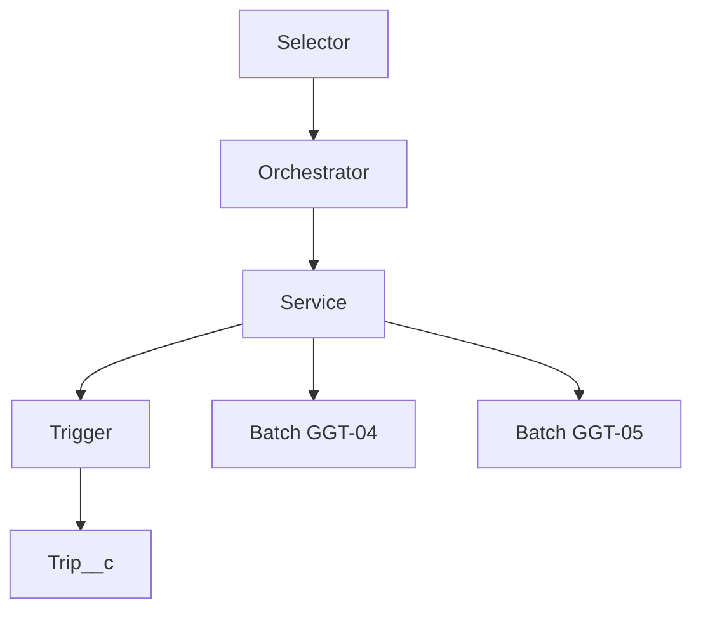
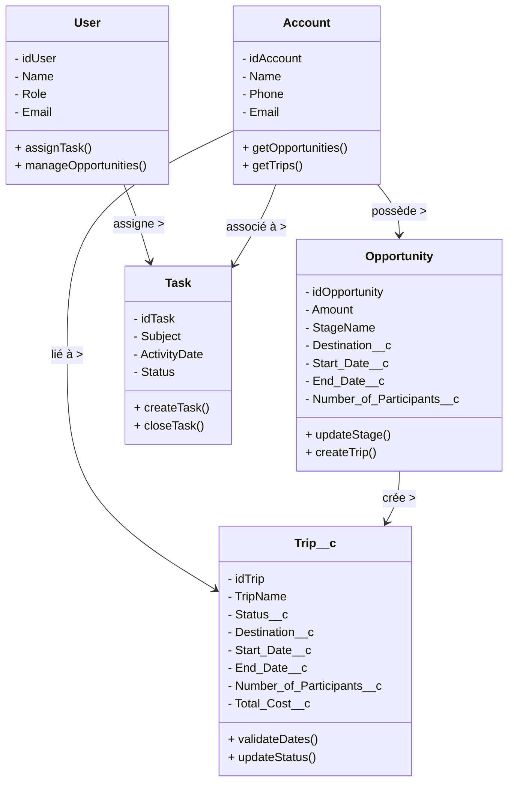
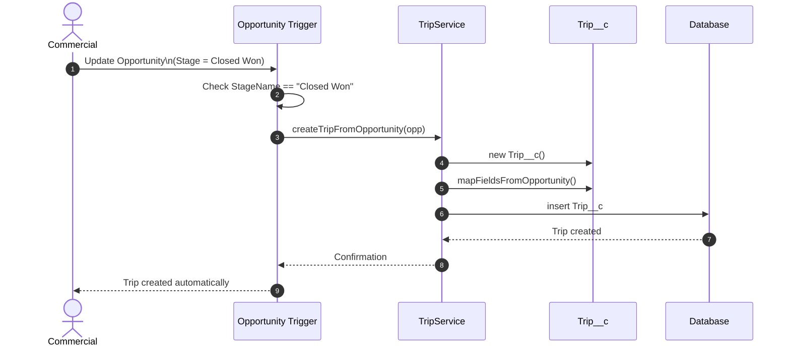
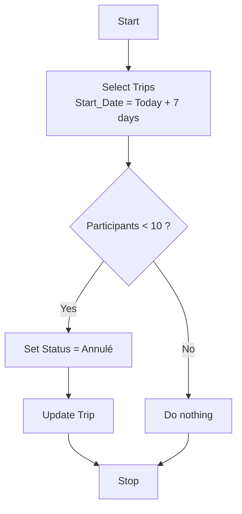
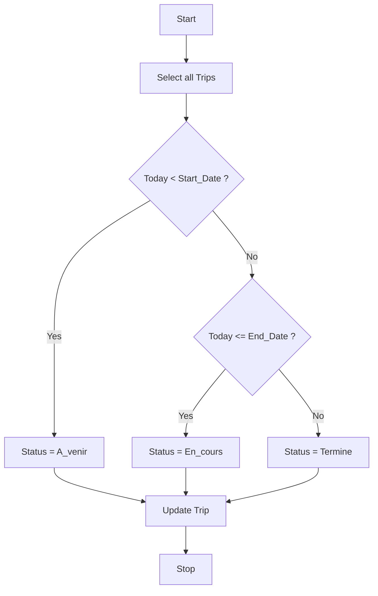

# Projet 8 – Salesforce CRM pour GlobalGroupTravel

Développement d’un back-end Salesforce complet pour automatiser la gestion des voyages de groupe (Trip__c) à partir des opportunités gagnées.

## 🧭 Sommaire

- [Contexte](#contexte)
- [Architecture](#architecture)
- [Diagrammes UML](#diagrammes-uml)
- [Diagrammes Mermaid](#diagrammes-mermaid)
- [Technologies utilisées](#technologies-utilisées)
- [Auteur](#auteur)

---

## 📌 Contexte

GlobalGroupTravel souhaite optimiser ses processus de vente et de suivi client via une solution CRM Salesforce.  
Le projet inclut :

- Création de l’objet personnalisé `Trip__c`
- Automatisation via triggers Apex
- Batchs Apex pour annulation et mise à jour des statuts
- Relations entre Account, Opportunity, Trip__c, Task, User
- 100 % de couverture de test

---

## 🧱 Architecture

---

## 🧠 Diagrammes UML

### Diagramme de Classes

---

## 🎭 Diagrammes Mermaid

### Séquence – Trigger Opportunity

### Activité – Batch GGT-04

### Activité – Batch GGT-05

---

## 🛠️ Technologies utilisées

- Salesforce Apex  
- Triggers & Batch Apex  
- Salesforce DX  
- Git & GitHub  
- Mermaid (diagrammes)  
- VS Code  

---

## 👩‍💻 Auteur

Murielle Majesté – Développeuse Salesforce  
GitHub : https://github.com/muriellemajeste1971-collab  
LinkedIn : https://www.linkedin.com/in/murielle-majesté-52698620 
